# Controllers

### Converters

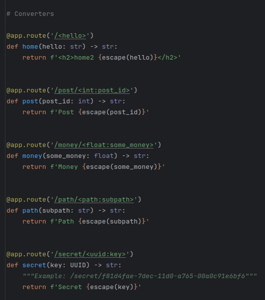

### Unique Redirect Behavior

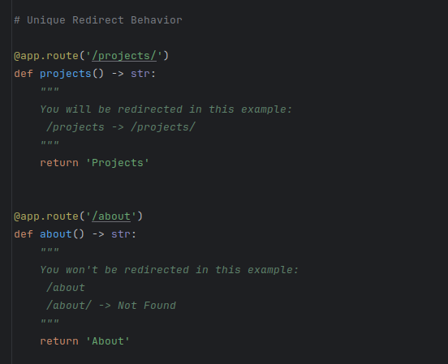

### URL Building (reverse)

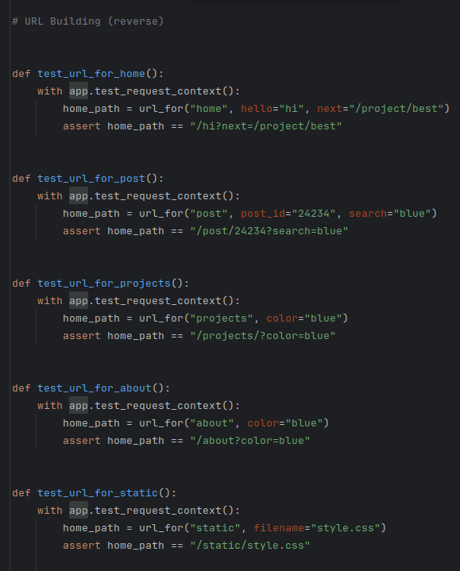

### Acceptable Methods for controller

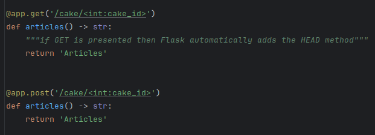

### Route alternatives

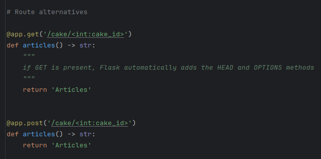

### Double Route

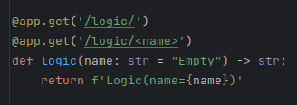

### Template AntiPattern

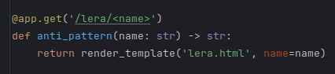

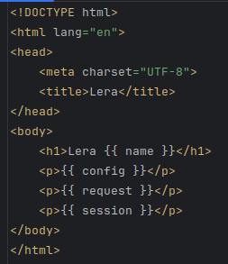

### How to access global objects?

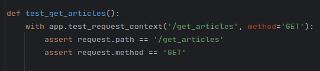

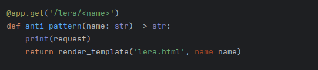

### Request Object

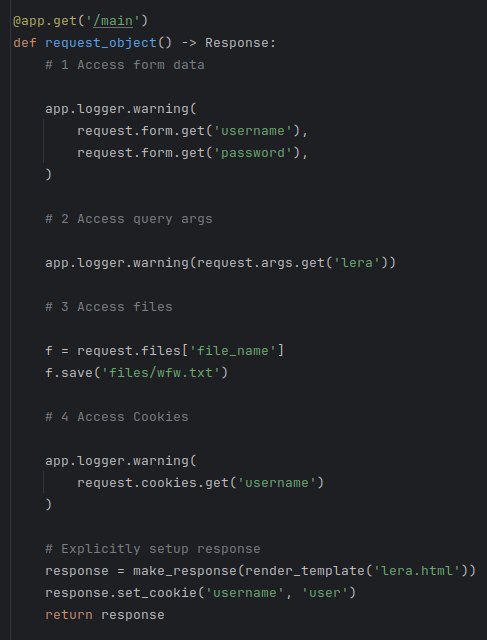

### Redirect and Aborts

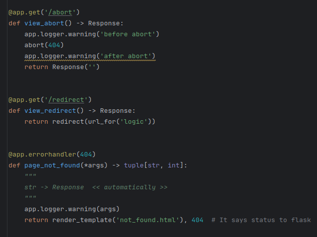

### Response

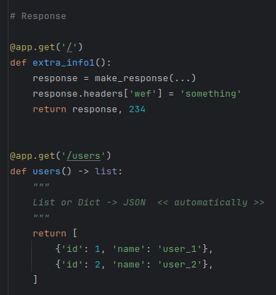

### Session

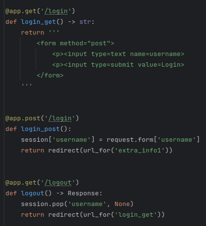
